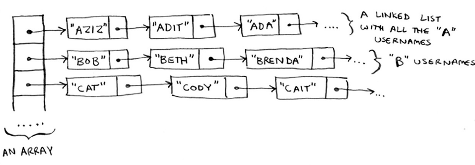

#### 2.1 Suppose you’re building an app to keep track of your finances.
    1 - GROCERIES
    2 - MOVIE
    3 - SFBC
        MEMBERSHIP
#### Every day, you write down everything you spent money on. At the end of the month, you review your expenses and sum up how much you spent. So, you have lots of inserts and a few reads. Should you use an array or a list?

### ANSWER:
Linked List : `INSERT O(1)` (you have lots of inserts and a few reads)

-----------------------------------------------------------

#### 2.2 Suppose you’re building an app for restaurants to take customer orders. Your app needs to store a list of orders. Servers keep adding orders to this list, and chefs take orders off the list and make them. It’s an order queue: servers add orders to the back of the queue, and the chef takes the first order off the queue and cooks it. Would you use an array or a linked list to implement this queue?
`(Hint: Linked lists are good for inserts/deletes, and arrays are good
for random access. Which one are you going to be doing here?)`

### ANSWER: 
Linked List [ dynamic size, sequential access ]

-----------------------------------------------------------

#### 2.3 Let’s run a thought experiment. Suppose Facebook keeps a list of usernames. When someone tries to log in to Facebook, a search is done for their username. If their name is in the list of usernames, they can log in. People log in to Facebook pretty often, so there are a lot of searches through this list of usernames. Suppose Facebook uses binary search to search the list. Binary search needs random access—you need to be able to get to the middle of the list of usernames instantly. Knowing this, would you implement the list as an array or a linked list?

### ANSWER:
Array, we can use binary search with arrays, because it has random access property to get the middle element instantly.

-----------------------------------------------------------

#### 2.4 People sign up for Facebook pretty often, too. Suppose you decided to use an array to store the list of users. What are the downsides of an array for inserts? In particular, suppose you’re using binary search to search for logins. What happens when you add new users to an array?

### ANSWER:
1. time-complexity `O(N)` = big time if many users
2. We must sort the names before add it to array = to use binary search
3. At some point, the array will fill up, and I won't be able to use it.

-----------------------------------------------------------

#### 2.5 In reality, Facebook uses neither an array nor a linked list to store user information. Let’s consider a hybrid data structure: an array of linked lists. You have an array with 26 slots. Each slot points to a linked list. For example, the first slot in the array points to a linked list containing all the usernames starting with a. The second slot points to a linked list containing all the usernames starting with b, and so on.

#### Suppose Adit B signs up for Facebook, and you want to add them to the list. You go to slot 1 in the array, go to the linked list for slot 1, and add Adit B at the end. Now, suppose you want to search for Zakhir H. You go to slot 26, which points to a linked list of all the Z names. Then you search through that list to find Zakhir H. Compare this hybrid data structure to arrays and linked lists. Is it slower or faster than each for searching and inserting? You don’t have to give Big O run times, just whether the new data structure would be faster or slower.

### ANSWER:
- **Insertion:**
    - **<ins>Faster than arrays</ins>**(because it avoids the need for resizing and shifting elements).
    - **Comparable** to linked lists (inserts into a specific linked list are quick once the correct slot is found).
- **Search:**
    - **<ins>Faster than linked lists</ins>** (because it reduces the search space by directly accessing the relevant linked list).
    - **Comparable** to arrays (faster than an unsorted array, but not as fast as a sorted array with binary search).