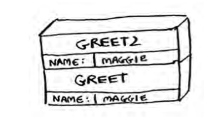

#### 3.1 : What information can you give, just based on this call stack?

**<ins> answer </ins>**
- There are two functions `greet(name)` and `greet2(name)`
the value of parameter called [name = maggie].

- First add the `greet()` function inside the stack then add `greet2()`.

- When make execution for the program the top-most function `greet2()`
will be executed first and then deleted from the stack.

---------------------------------------------------------------

#### 3.2: What happens to the stack when your recursive function runs forever?

**<ins> answer </ins>**
- `Stack Overflow error`

