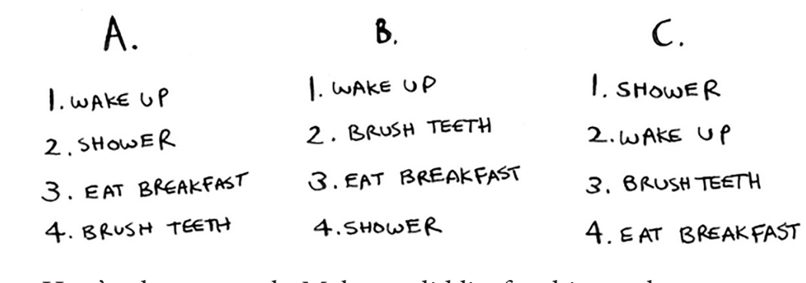
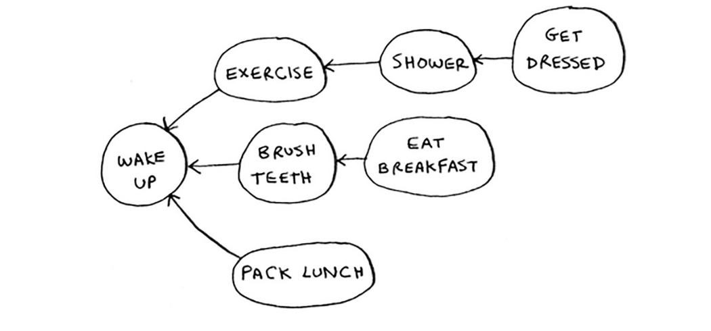

#### 6.1 Find the length of the shortest path from start to finish.
  
`Shortest path colored in Red`  
**<ins>answer</ins>**
- Length of shortest path is `2`
---------------------------------------------------------
#### 6.2 Find the length of the shortest path from “cab” to “bat”
  
**<ins>answer</ins>**
- Length of shortest path is `2`
---------------------------------------------------------
#### 6.3 For these three lists, mark whether each one is valid or invalid.
  
`NOTE: can’t eat breakfast until I’ve brushed my teeth. So “eat breakfast” depends on “brush teeth”.`  
**<ins>answer</ins>**
- **_(A) Invalid_**, becuase brushing my teeth should be before eating breakfast depending on the graph.
- **_(B) Valid_**, because brushing my teeth founded before eating breakfast.
- **_(C) Invalid_**, because we should starts with wake up first not showring.
---------------------------------------------------------
#### 6.4 Here’s a larger graph. Make a valid list for this graph.
  
**<ins>answer</ins>**  
1. Wake up
2. Excercise
3. Shower
4. Brush teeth
5. Get dressed
6. Pack lunch
7. Eat breakfast

---------------------------------------------------------
#### 6.5 Which of the following graphs are also trees?
  
**<ins>answer</ins>**
- **_(A) Tree_**, because there are not edges ever point back.
- **_(B) Not Tree_**, this called **Graph** because there are edges point back to the parent 
- **_(C) Tree_**, the same resone in the first example but this tree is sideways.
---------------------------------------------------------
